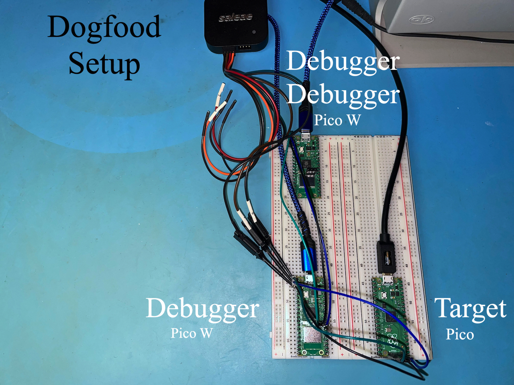
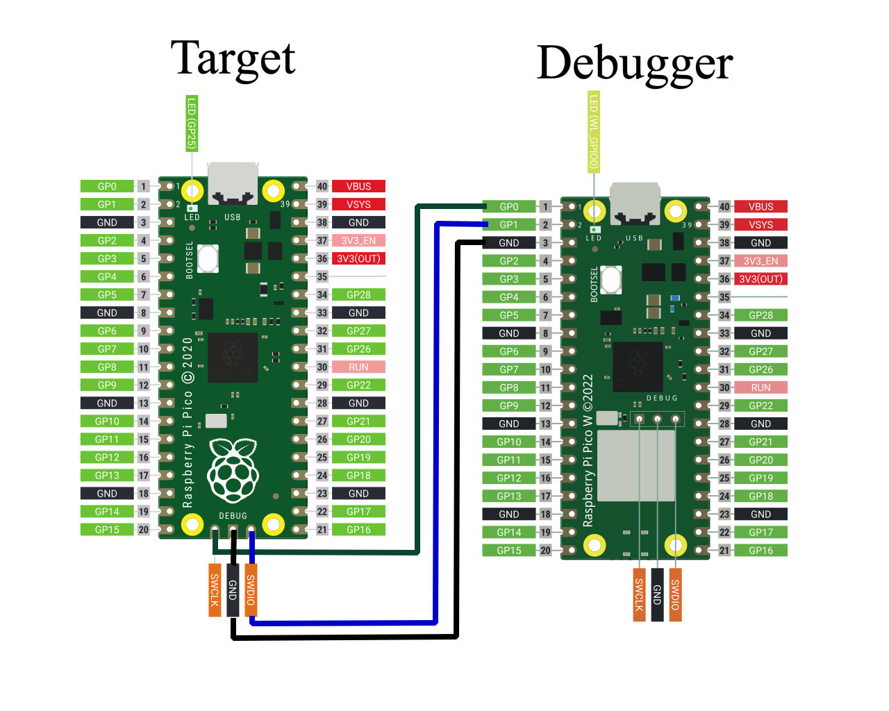

# MRI-SWD - A Work In Progress!
## Monitor for Remote Inspection - SWD Edition
`mri-swd` is a [Pico W](https://www.adafruit.com/product/5526) based debug probe for debugging Cortex-M based microcontrollers with the [GNU debugger (GDB)](https://www.sourceware.org/gdb/). GDB can connect to the `mri-swd` debug probe over WiFi and the debug probe then connects to the debug target using SWD.


## Table of Contents
* [Important Notes](#important-notes): Important goals, non-goals, and limitations of this `mri-swd` project.
* [Supported Features](#supported-features): What's currently supported by `mri-swd`.
* [Unsupported Features](#unsupported-features): What's not currently supported by `mri-swd` but might be in the future.
* [WiFi Configuration](#wifi-configuration): How to configure the SSID and Password needed for your wireless network so that they can be compiled into the `mri-swd` firmware.
* [How to Build](#how-to-build): Notes describing how to build `mri-swd`.
* [Wiring Diagram](#wiring-diagram): Diagram showing how to connect the debugger to the target.
* [Connecting GDB](#connecting-gdb): How to startup `mri-swd` and connect GDB.
* [Firmware Configuration](#firmware-configuration): Using `config.h` to customize the `mri.swd` firmware.
* [Next Steps](#next-steps): What features am I working on next.


## Important Notes


* __[5/17/2023]:__ The code found within this repository is now at the point where I can start using it to flash and debug the `mri-swd` firmware itself instead of the Segger J-Link that I had been using previously. This testing will help me to find bugs, missing features, and rough edges to correct over the upcoming weeks, getting it ready for others to use.
* The initial goal is to just be able to debug and program the dual core [RP2040 microcontroller](https://www.raspberrypi.com/products/rp2040/). Support for other microcontrollers will be added in the future.
* The `mri-swd` firmware is initially being developed to run on the low cost [Pico W](https://www.adafruit.com/product/5526). It will use the Pico W's WiFi capabilities to wirelessly communicate with GDB. No intermediate program like OpenOCD will be required since the [mri remote debug stub](https://github.com/adamgreen/mri) functionality will be running on the Pico W itself.


## Supported Features
* Supports debugging of **Core 0 on the RP2040**
* RAM/FLASH/ROM Read
* RAM Write
* CPU Register Read/Write
* `load` (**FLASH Programming** of RP2040)
* `step` and `next` (Single Stepping)
* `break` (Hardware Breakpoints)
* `watch`, `awatch`, `rwatch` (Hardware Watchpoints)
* `monitor reset` (Reboot the microcontroller)
* GDB connection over WiFi on port 4242

## Unsupported Features
* Debugging of **Core 1 on the RP2040**
* Debugging of microcontrollers other than the RP2040 for various reasons, including:
    * No **FPU** support
    * `mri-swd` returns fixed memory layout (suitable for the RP2040) to GDB
    * SWD clock is fixed at 24MHz
* FLASH programming of microcontrollers other than the RP2040.
* Semihosting
* RTOS Thread Support
* Connecting GDB over USB. Only WiFi for now.


## WiFi Configuration
Currently the SSID and Password for accessing the WiFi network need to be compiled into the firmware. You need to create a `wifi_config.cmake` file in the root of the project to provide the values appropriate for your network. Here is an example of its required contents (update with your particular SSID and password):

**wifi_config.cmake Example**
```cmake
set(WIFI_SSID YourSSID)
set(WIFI_PASSWORD YourPassword)
```
This file is included in the repository's `.gitignore` so that it isn't accidentally committed and pushed to a public server.

**Note:** _I will provide a way to set these WiFi settings over USB in the future._


## How to Build
### GNU Make based Auto Setup
This repository contains the [pico-sdk](https://github.com/raspberrypi/pico-sdk) and [mri core](https://github.com/adamgreen/mri) repositories as submodules. The following GNU Make command will initialize these submodules and apply the needed patches:
```shell
make init
```

GNU Make can also be used to kick off the initial build:
```shell
make all
```

This will generate output files in the `build/` folder. Subsequent builds can be performed by executing the Makefile now found in this folder:
```shell
cd build/
make
```

### CMake based Manual Setup
As this is a [pico-sdk](https://github.com/raspberrypi/pico-sdk) project, it uses [CMake](https://cmake.org) to perform the build. The above described `/Makefile` has only been tested on macOS but may work on other Posix systems such as Linux as well. If you are running on Windows and are already familiar with using CMake to build pico-sdk based projects on that platform then you can instead perform the setup manually:

```shell
cd mri
git submodule update --init
cd pico-sdk
git submodule update --init
mkdir build
cd build
cmake -G "NMake Makefiles" ..
nmake
```

This build will encounter an error when building some of the pico-sdk sources. This is because I enable more compilers warnings than the pico examples. You can look at [pico-sdk.patch](pico-sdk.patch) to see what changes need to be manually applied to fix these build errors.


## Wiring Diagram


Currently only 2 signal wires (and ground) need to be connected between the target RP2040 device and the Pico W based debugger device:
| Pico W Debugger | Pico Target |
|-----------------|-------------|
| GPIO 0          | SWCLK       |
| GPIO 1          | SWDIO       |
| Gnd             | Gnd         |

Both devices, target and debugger, need power. It is common to power each of the devices via their individual USB connectors.

**Note:** _In the future I will probably switch to pins other than GPIO 0 and GPIO 1 on the Debugger side as those are the default UART pins but for now I am just using the first 2 pins that were available._


## Connecting GDB
### IP Address
A terminal program must be connected to the USB based serial connection made available from the Pico W running the `mri-swd` firmware. When `mri-swd` is starting up output like the following will be seen in this terminal session:
```
 info: main.cpp:38 main() - Starting up...
 info: main.cpp:41 main() - Connecting to Wi-Fi router...
 info: main.cpp:49 main() - Connected.
error: mri_platform.cpp:189 initSWD() - Found target=0x01002927 with DPIDR=0x0BC12477
 info: mri_platform.cpp:198 initSWD() - Initializing target's debug components...
debug: swd.cpp:583 checkAP() - peripheralComponentIDs[]=
debug: swd.cpp:584 checkAP() - {
debug: swd.cpp:587 checkAP() -     0x00000004
debug: swd.cpp:587 checkAP() -     0x00000000
debug: swd.cpp:587 checkAP() -     0x00000000
debug: swd.cpp:587 checkAP() -     0x00000000
debug: swd.cpp:587 checkAP() -     0x000000C0
debug: swd.cpp:587 checkAP() -     0x000000B4
debug: swd.cpp:587 checkAP() -     0x0000000B
debug: swd.cpp:587 checkAP() -     0x00000000
debug: swd.cpp:587 checkAP() -     0x0000000D
debug: swd.cpp:587 checkAP() -     0x00000010
debug: swd.cpp:587 checkAP() -     0x00000005
debug: swd.cpp:587 checkAP() -     0x000000B1
debug: swd.cpp:589 checkAP() - }
debug: swd.cpp:598 checkAP() - CPUID=0x410CC601
 info: mri_platform.cpp:205 initSWD() - Initialization complete!
 info: gdb_socket.cpp:33 init() - Starting server at 10.0.0.24 on port 4242
```
The last line shows the `10.0.0.24` IP address assigned to the `mri-swd` device on this particular network. Take note of this IP address so that it can be used later when attaching GDB.

### GDB Connection
The following is an example shell session where GDB is launched and told to connect and start debugging a RP2040 microcontroller via the WiFi IP address that was noted in the previous section (`10.0.0.24`):
```
$ arm-none-eabi-gdb -ex "set target-charset ASCII" -ex "set print pretty on" -ex "set remotelogfile mri.log" -ex "target remote 10.0.024:4242" -ex "set mem inaccessible-by-default off" test.elf

GNU gdb (Arm GNU Toolchain 12.2 (Build arm-12-mpacbti.34)) 13.1.90.20230307-git
Copyright (C) 2023 Free Software Foundation, Inc.
License GPLv3+: GNU GPL version 3 or later <http://gnu.org/licenses/gpl.html>
This is free software: you are free to change and redistribute it.
There is NO WARRANTY, to the extent permitted by law.
Type "show copying" and "show warranty" for details.
This GDB was configured as "--host=aarch64-apple-darwin20.6.0 --target=arm-none-eabi".
Type "show configuration" for configuration details.
For bug reporting instructions, please see:
<https://bugs.linaro.org/>.
Find the GDB manual and other documentation resources online at:
    <http://www.gnu.org/software/gdb/documentation/>.

For help, type "help".
Type "apropos word" to search for commands related to "word"...
Reading symbols from build/QuadratureDecoder.elf...
Remote debugging using 10.0.0.24:4242
time_us_64 () at /Users/foobar/QuadratureDecoder/pico-sdk/src/rp2_common/hardware_timer/timer.c:44
44	        lo = timer_hw->timerawl;
(gdb)
```


## Firmware Configuration
In the root folder can be found  a [config.h](config.h) which can be used to customize the `mri-swd` firmware. This header file allows configuration of things such as:
* GPIO pins to be used for connections to the target.
* TCP/IP port number to which GDB should be connected.
* Logging enable/disable settings for each module in the `mri-swd` firmware:
  * `logError()` calls let the user know about unexpected errors. They can be disabled per module in `config.h` but typically should be left enabled.
  * `logDebug()` calls give information about the inner workings of the code and are most useful to `mri-swd` developers. They can be disabled per module in the `config.h` header.
  * `logInfo()` calls inform the user what the debugger firmware is currently doing. They can't be disabled.
* The size of the packets to be used for communication between `mri-swd` and GDB.
* ...


## Next Steps
* ~~RP2040 FLASH Programming~~
* ~~Improve Robustness~~
* Improve Performance
* Improve Usability
* Addition of a small OLED Display
  * Report IP address
  * Report WiFi connections
  * Report target detected
  * Report target Vcc voltage
  * etc
* RP2040 Core 1 Support
* Bridge microcontroller's UART on another WiFi TCP/IP port.
* Custom PCB
* Basic nRF52 (Cortex-M4F) Debugging Support
* Semihosting Support
