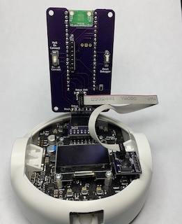
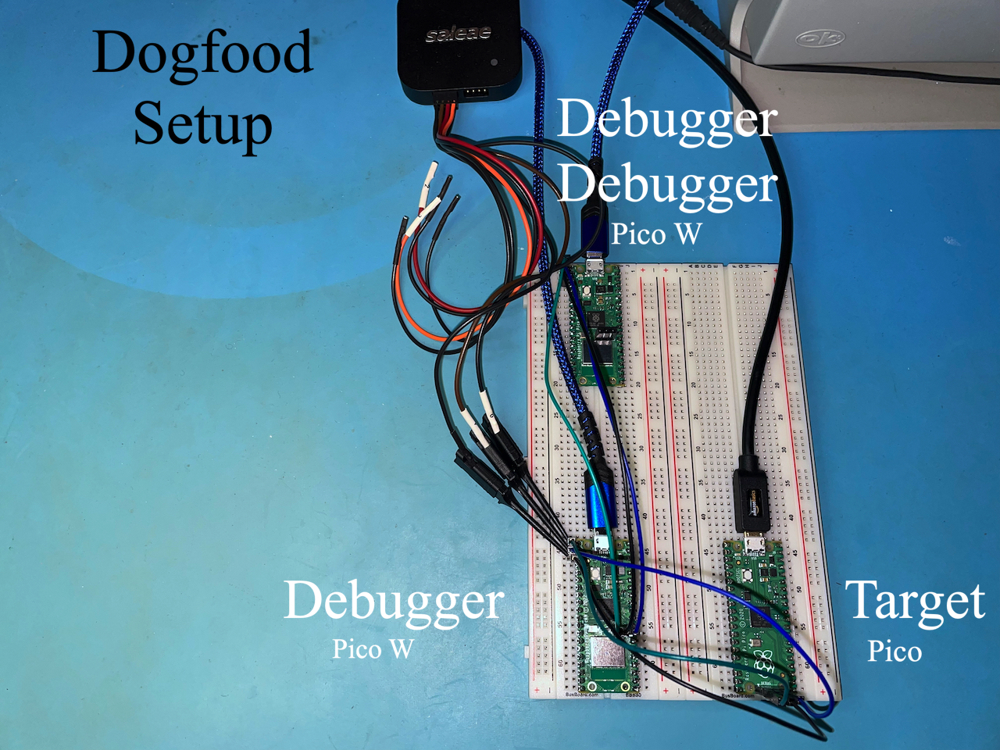
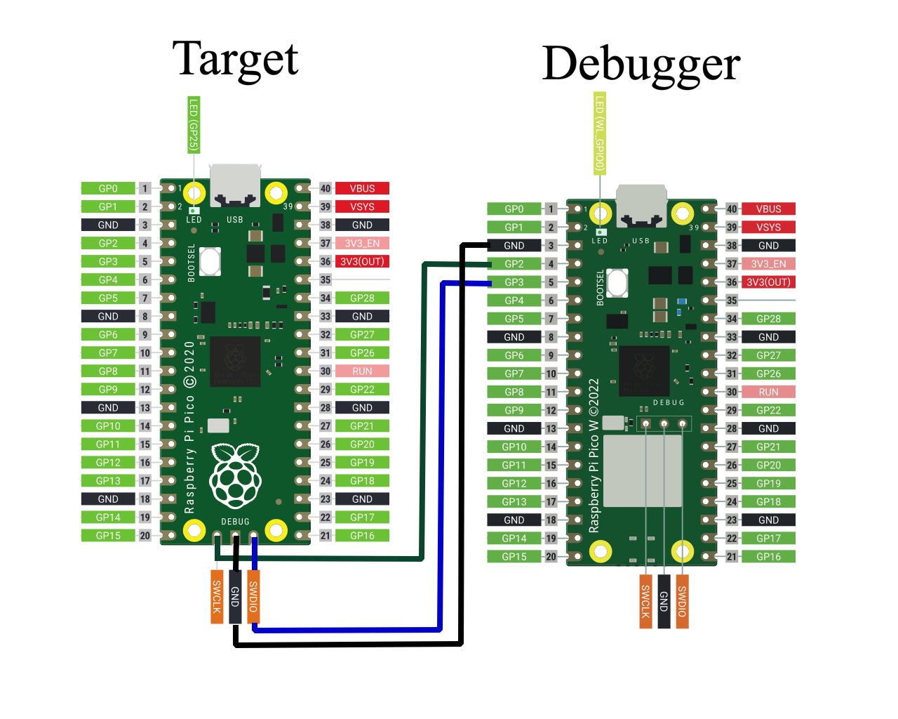
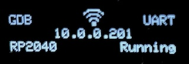
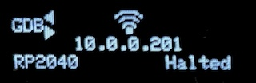
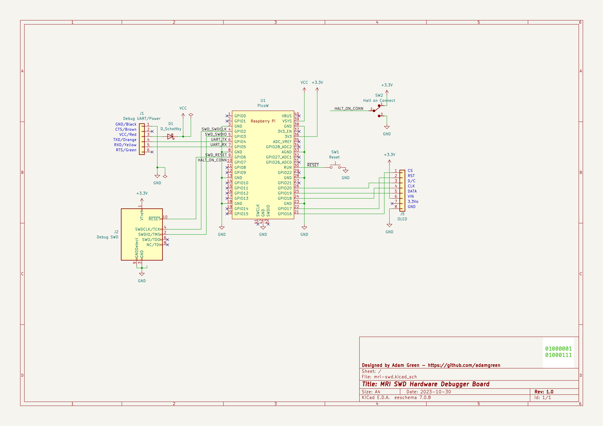
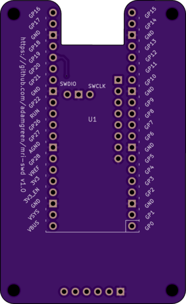
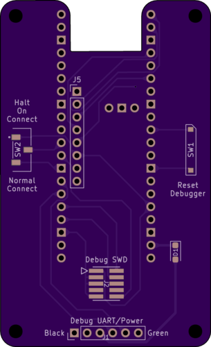
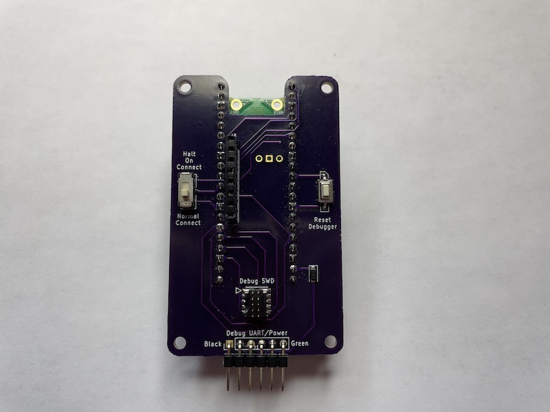

# MRI-SWD - A Work In Progress!
## Monitor for Remote Inspection - SWD Edition
`mri-swd` is a [Pico W](https://www.adafruit.com/product/5526) based debug probe for debugging Cortex-M based microcontrollers with the [GNU debugger (GDB)](https://www.sourceware.org/gdb/). GDB can connect to the `mri-swd` debug probe over WiFi and the debug probe then connects to the debug target using SWD.



## Table of Contents
* [Important Notes](#important-notes): Important goals, non-goals, and limitations of this `mri-swd` project.
* [Supported Features](#supported-features): What's currently supported by `mri-swd`.
* [Unsupported Features](#unsupported-features): What's not currently supported by `mri-swd` but might be in the future.
* [WiFi Configuration](#wifi-configuration): How to configure the SSID and Password needed for your wireless network so that they can be compiled into the `mri-swd` firmware.
* [How to Build](#how-to-build): Notes describing how to build `mri-swd`.
* [Wiring Diagram](#wiring-diagram): Diagram showing how to connect the debugger to the target.
* [Connecting GDB](#connecting-gdb): How to startup `mri-swd` and connect GDB.
* [Firmware Configuration](#firmware-configuration): Using `config.h` to customize the `mri-swd` firmware.
* [OLED Status Display](#oled-status-display): The information displayed on the OLED.
* [Current Hardware Progress](#current-hardware-progress): The current state of `mri-swd` PCB development.
* [Next Steps](#next-steps): Features I am working on next.


## Important Notes


* __[8/25/2024]:__ The code found within this repository is now at the point where I regularly use it for debugging the `mri-swd` firmware itself and other RP2040 based projects. The WiFi abilities make it really useful for debugging RP2040 based electronics on mobile robot paltforms. Dogfooding it like this continue to surface more issues that can then be addressed to make it even better. I will continue with this dogfooding for several more months yet before deciding whether I should port `mri-swd` to the [Raspberry Pi Debug Probe](https://www.raspberrypi.com/products/debug-probe/) and make a more public announcement about this alternative debug probe firmware.
* The initial goal is to just be able to debug and program the dual core [RP2040 microcontroller](https://www.raspberrypi.com/products/rp2040/). Support has also been added for the [nRF52xxx family of microcontrollers](https://infocenter.nordicsemi.com/index.jsp?topic=%2Fstruct_nrf52%2Fstruct%2Fnrf52.html) which was good for making sure that it doesn't only work on the RP2040. Support for other Cortex-M based microcontrollers may be added in the future but it isn't currently a priority.
* The `mri-swd` firmware is initially being developed to run on the low cost [Pico W](https://www.adafruit.com/product/5526). It will use the Pico W's WiFi capabilities to wirelessly communicate with GDB. No intermediate program like OpenOCD will be required since the [mri remote debug stub](https://github.com/adamgreen/mri) functionality will be running on the Pico W itself.
* I want to concentrate on making this debugger work as well as possible for the devices and features that it does support. This brings me to my list of  **Non-Goals**:
  * JTAG Support
  * Devices other than Cortex-M microcontrollers


## Supported Features
* Supports debugging and programming of the **RP2040** microcontroller.
  * Does support the **nRF52xxx** microcontroller as well.
  * If may also be able to auto-detect other Cortex-M microcontrollers if they are attached but this isn't guaranteed. Any such detected devices will only support debugging and not programming.
* RAM/FLASH/ROM Read
* RAM Write
* CPU Register Read/Write
* `load` (**FLASH Programming** of RP2040 and nRF52xxx)
* `step` and `next` (Single Stepping)
* `break` (Hardware Breakpoints)
* `watch`, `awatch`, `rwatch` (Hardware Watchpoints)
* `monitor reset [halt]` (Reboot the microcontroller)
* `monitor detach` (Power down target DAP and shutdown mri-swd)
* `info thread` and `thread`:
  * Only used to expose the second RP2040 core at this point in time
  * **No RTOS** support
* GDB connection over WiFi on **port 2331**
* Host access to the Target's UART on **port 2332** (UART<->WiFi Bridging)
* Semihosting
* [128x32 Monochrome OLED](https://www.adafruit.com/product/661) for reporting Debugger/Target status

## Unsupported Features
* RTOS Thread Support
* Connecting GDB over USB. Only WiFi for now.


## WiFi Configuration
Currently the SSID and Password for accessing the WiFi network need to be compiled into the firmware. You need to create a `wifi_config.cmake` file in the root of the project to provide the values appropriate for your network. Here is an example of its required contents (update with your particular SSID and password):

**wifi_config.cmake Example**
```cmake
set(WIFI_SSID YourSSID)
set(WIFI_PASSWORD YourPassword)
```
This file is included in the repository's `.gitignore` so that it isn't accidentally committed and pushed to a public server.

**Note:** _I will provide a way to set these WiFi settings over USB in the future._


## How to Build
### GNU Make based Auto Setup
This repository contains the [pico-sdk](https://github.com/raspberrypi/pico-sdk) and [mri core](https://github.com/adamgreen/mri) repositories as submodules. The following GNU Make command will initialize these submodules:
```shell
make init
```

GNU Make can also be used to kick off the initial build:
```shell
make all
```

This will generate output files in the `build/` folder. Subsequent builds can be performed by executing the Makefile now found in this folder:
```shell
cd build/
make
```

### CMake based Manual Setup
As this is a [pico-sdk](https://github.com/raspberrypi/pico-sdk) project, it uses [CMake](https://cmake.org) to perform the build. The above described `/Makefile` has only been tested on macOS but may work on other Posix systems such as Linux as well. If you are running on Windows and are already familiar with using CMake to build pico-sdk based projects on that platform then you can instead perform the setup manually:

```shell
cd mri
git submodule update --init
cd pico-sdk
git submodule update --init
mkdir build
cd build
cmake -G "NMake Makefiles" ..
nmake
```


## Wiring Diagram


Currently only 2 signal wires (and ground) need to be connected between the target RP2040 device and the Pico W based debugger device:
| Pico W Debugger | Pico Target |
|-----------------|-------------|
| GPIO 2          | SWCLK       |
| GPIO 3          | SWDIO       |
| Gnd             | Gnd         |

Both devices, target and debugger, need power. It is common to power each of the devices via their individual USB connectors.


## Connecting GDB
### IP Address
#### Using OLED
Now that `mri-swd` supports using an [Adafruit 128x32 Monochrome OLED](https://www.adafruit.com/product/661) for showing its status, what follows is now the preferred method of determining the IP address assigned by DHCP.

When `mri-swd` first powers up it will show an animating WiFi icon as it attempts to connect to the specified WiFi network:


Once the connection has been made the logo will stop animating and the DHCP assigned IP address will be shown below the logo:


The assigned IP address is shown as `10.0.0.201`

#### Over USB Serial
Originally the only way to determine the DHCP assigned IP address was by using the output `mri-swd` sends to the USB based serial port as described below.

A terminal program must be connected to the USB based serial connection made available from the Pico W running the `mri-swd` firmware. When `mri-swd` is starting up output like the following will be seen in this terminal session:
```
  info: main.cpp:33 main() - Starting up...
 info: mri_platform.cpp:214 attemptSwdAttach() - Found DPv2 SWD Target=0x01002927 with DPIDR=0x0BC12477
 info: mri_platform.cpp:227 attemptSwdAttach() - Initializing target's debug components...
debug: swd.cpp:645 checkAP() - peripheralComponentIDs[]=
debug: swd.cpp:646 checkAP() - {
debug: swd.cpp:649 checkAP() -     0x00000004
debug: swd.cpp:649 checkAP() -     0x00000000
debug: swd.cpp:649 checkAP() -     0x00000000
debug: swd.cpp:649 checkAP() -     0x00000000
debug: swd.cpp:649 checkAP() -     0x000000C0
debug: swd.cpp:649 checkAP() -     0x000000B4
debug: swd.cpp:649 checkAP() -     0x0000000B
debug: swd.cpp:649 checkAP() -     0x00000000
debug: swd.cpp:649 checkAP() -     0x0000000D
debug: swd.cpp:649 checkAP() -     0x00000010
debug: swd.cpp:649 checkAP() -     0x00000005
debug: swd.cpp:649 checkAP() -     0x000000B1
debug: swd.cpp:651 checkAP() - }
debug: swd.cpp:660 checkAP() - CPUID=0x410CC601
 info: mri_platform.cpp:234 attemptSwdAttach() - SWD initialization complete!
 info: mri_platform.cpp:240 initNetwork() - Initializing network...
 info: mri_platform.cpp:251 initNetwork() - Attempting to connect to Wi-Fi router...
 info: mri_platform.cpp:254 initNetwork() - Connected to Wi-Fi router.
 info: gdb_socket.cpp:36 init() - Starting server at 10.0.0.201 on port 2331
 info: mri_platform.cpp:795 initDWT() - CPU supports 2 hardware watchpoints.
 info: mri_platform.cpp:857 initFPB() - CPU supports 4 hardware breakpoints.
```
The third line up from the bottom shows the `10.0.0.201` IP address assigned to the `mri-swd` device on this particular network. Take note of this IP address so that it can be used later when attaching GDB.

### GDB Connection
The following is an example shell session where GDB is launched and told to connect and start debugging a RP2040 microcontroller via the WiFi IP address that was noted in the previous section (`10.0.0.201`). Port `2331` is the default TCP/IP port number used by `mri-swd` but it can be changed in the [config.h](config.h) file discussed further down in this documentation.

```console
$ arm-none-eabi-gdb -ex "set target-charset ASCII" -ex "set print pretty on" -ex "set remotelogfile mri.log" -ex "target remote 10.0.0.201:2331" -ex "set mem inaccessible-by-default off" test.elf

GNU gdb (Arm GNU Toolchain 12.2 (Build arm-12-mpacbti.34)) 13.1.90.20230307-git
Copyright (C) 2023 Free Software Foundation, Inc.
License GPLv3+: GNU GPL version 3 or later <http://gnu.org/licenses/gpl.html>
This is free software: you are free to change and redistribute it.
There is NO WARRANTY, to the extent permitted by law.
Type "show copying" and "show warranty" for details.
This GDB was configured as "--host=aarch64-apple-darwin20.6.0 --target=arm-none-eabi".
Type "show configuration" for configuration details.
For bug reporting instructions, please see:
<https://bugs.linaro.org/>.
Find the GDB manual and other documentation resources online at:
    <http://www.gnu.org/software/gdb/documentation/>.

For help, type "help".
Type "apropos word" to search for commands related to "word"...
Reading symbols from build/QuadratureDecoder.elf...
Remote debugging using 10.0.0.201:2331
get_absolute_time () at /depots/QuadratureDecoder/pico-sdk/src/common/pico_time/include/pico/time.h:63
63	    update_us_since_boot(&t, time_us_64());
(gdb) load
Loading section .boot2, size 0x100 lma 0x10000000
Loading section .text, size 0x7130 lma 0x10000100
Loading section .rodata, size 0x17c8 lma 0x10007230
Loading section .binary_info, size 0x1c lma 0x100089f8
Loading section .data, size 0x2dc lma 0x10008a14
Start address 0x100001e8, load size 36080
Transfer rate: 47 KB/sec, 5154 bytes/write.
```


## UART<->WiFi Bridging
The target's UART pins can be connected to the `mri-swd` debugger as shown in this table:
| Pico W Debugger | Pico Target |
|-----------------|-------------|
| GPIO 0          | UART Rx     |
| GPIO 1          | UART Tx     |
| Gnd             | Gnd         |

If those connections are made then the target can configure its UART for **230400-8-N-1** communication and this UART will then be accessible from the PC host connected to `mri-swd` on TCP/IP port **2332** (can be changed in config.h). The PC host can then use a simple TCP/IP terminal emulator such as `telnet` to communicate with the target's UART over WiFi on this port:
```console
~$ telnet -N 10.0.0.201 2332
Trying 10.0.0.201...
Connected to 10.0.0.201.
Escape character is '^]'.
Send this data to target over UART and have it loop it back to the PC!
Send this data to target over UART and have it loop it back to the PC!
^]
telnet> quit
Connection closed.
```
**Note:** The IP address to be used with `telnet` above should match the IP address you use for connecting GDB to the same `mri-swd` debug probe.


## Firmware Configuration
In the root folder can be found  a [config.h](config.h) which can be used to customize the `mri-swd` firmware. This header file allows configuration of things such as:
* GPIO pins to be used for connections to the target.
* TCP/IP port number to which GDB should be connected.
* Logging enable/disable settings for each module in the `mri-swd` firmware:
  * `logError()` calls let the user know about unexpected errors. They can be disabled per module in `config.h` but typically should be left enabled.
  * `logDebug()` calls give information about the inner workings of the code and are most useful to `mri-swd` developers. They can be disabled per module in the `config.h` header.
  * `logInfo()` calls inform the user what the debugger firmware is currently doing. They can't be disabled.
* The size of the packets to be used for communication between `mri-swd` and GDB.
* ...


## OLED Status Display
* When `mri-swd` is first attempting to connect to the specified WiFi network, it will show the following WiFi logo animation:<br>
<br>
* Once the connection has been made the logo will stop animating and the DHCP assigned IP address will be shown below the logo. In the following image, the assigned IP address of `10.0.0.201` can be seen along with 2 additional status messages on the bottom line:
  * On the bottom left is the type of target device connected via SWD, `RP2040`.
  * On the bottom right is the current state of the target device connected via SWD, `Halted`.<br>
 <br>
* Once GDB connects to `mri-swd`'s port **2331**, the word `GDB` will show up in the upper left hand corner of the display. Similarly when a terminal program like Telnet connects to `mri-swd`'s port **2332**, the word `UART` will show up in the upper right hand corner. The following image shows clients connected to both ports. It also shows the current state of the target as `Running` in the lower right hand corner: <br>
<br>
* There are also little arrows that light up next to the `GDB` and `UART` designators when data is being sent to and from each of their corresponding TCP/IP clients:
<br><br>
<br><br>


## Current Hardware Progress
I have designed a PCB that allows attaching a PicoW to my [Pololu 3π+ 2040 robot](https://www.pololu.com/category/300/3pi-plus-2040-robot). The images below show my current progress on that project.<br>
</br>

</br>
</br>


## Next Steps
* ~~RP2040 FLASH Programming~~
* ~~Improve Robustness~~
* ~~Basic nRF52 (Cortex-M4F) Debugging Support~~
* ~~Semihosting Support~~
* ~~Custom PCB~~
* ~~Improve Performance~~
* ~~RP2040 Core 1 Support~~
* ~~Bridge microcontroller's UART on another WiFi TCP/IP port.~~
* ~~Addition of a small OLED Display~~
  * ~~Report IP address~~
  * ~~Report WiFi connection state~~
  * ~~Report WiFi activity~~
  * ~~Report target detected~~
  * ~~Report target run state~~
* RTOS Thread Support
* Improve Usability
